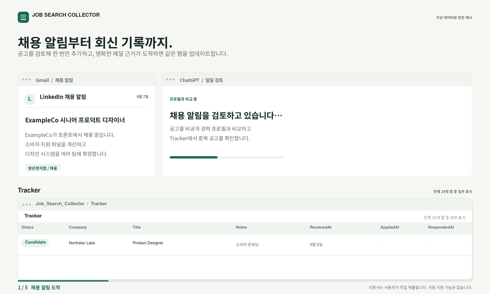
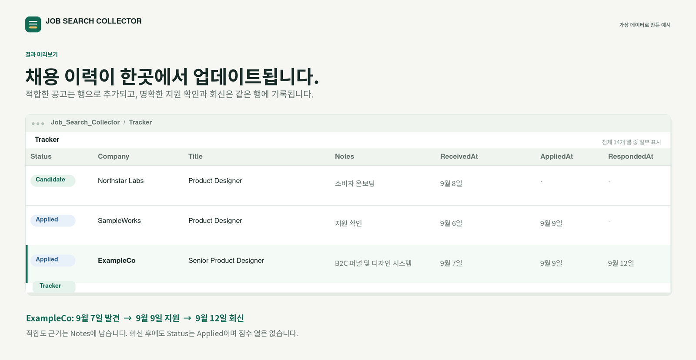

[English](README.md) | [한국어](README.ko.md)

# Job Search Collector

**채용 알림을 내 경력에 맞는 구직 Tracker로 정리하세요.**

Job Search Collector는 ChatGPT Scheduled Task로 Gmail 채용 알림을 확인하고, 원하면 공개 웹에서도 공고를 찾습니다. 비공개 커리어 프로필과 비교해 적합한 이유를 제시하고, 중복을 확인하며, 사용 가능한 연결 기능이 허용할 때 Google Sheets에서 지원과 회신 이력을 관리합니다.

**Gmail 채용 알림 + 선택적 웹 탐색 → 경력 적합도 판단 → 하나의 Google Sheets Tracker**



*가상 데이터를 사용한 설명용 영상입니다. 실제 연결 계정의 녹화 화면은 아닙니다.*

### 결과 먼저 보기



아래는 **가상 데이터로 만든 예시**이며 Tracker 열 일부만 보여줍니다. 실제 Tracker에는 지원일과 회신일을 포함해 [14개 열](docs/sheet-schema.md#tracker)이 있습니다. 적합도 근거는 별도의 점수 열 대신 `Notes`에 기록됩니다.

| Status | Company | Title | Location | Notes | ReceivedAt | DiscoveryType | Source |
|---|---|---|---|---|---|---|---|
| Candidate | Northstar Labs | Product Designer | Remote, Canada | 소비자 온보딩 경험이 맞음 | 2026-09-08 | Search | Company Careers |
| Applied | ExampleCo | Senior Product Designer | Toronto, ON | B2C 퍼널과 디자인 시스템 경험이 맞음 | 2026-09-07 | Mail | LinkedIn |

계정 연결 없이 [가상 실행 예시](examples/sample-run.md)에서 채용 알림부터 리크루터 회신까지의 흐름을 확인할 수 있습니다. [일일 출력 예시](examples/output.example.md)에는 적합도 판단, 제외 사유, 진단 정보가 있습니다.

### 무엇을 해주나요?

- 채용 알림 메일과, 활성화한 경우 공개 웹에서 공고를 찾습니다.
- 경력과 실제 근무 조건에 맞춰 검토 우선순위를 정하고 근거를 보여줍니다.
- Tracker 이력과 비교해 같은 공고가 새 행으로 반복 등록되는 일을 방지합니다.
- 명확한 지원 확인과 리크루터 회신을 기록하고, 불확실한 내용은 사용자 검토로 보냅니다.

사용자를 대신해 지원서를 제출하지 않습니다. Google Sheets 직접 쓰기는 사용 가능한 기능과 권한에 따라 달라지며, 예약 실행에서 쓰기가 막히면 명시적인 TSV 대안을 반환할 수 있습니다.

## 시작하기

처음 시작할 때 사용자가 직접 복사해야 하는 프롬프트는 **하나뿐입니다.**

[`prompts/01-bootstrap.md`](prompts/01-bootstrap.md)

시작하기 전에 ChatGPT에 Gmail과 Google Drive를 연결합니다.

1. `01-bootstrap.md` 전체 내용을 새 ChatGPT 대화에 붙여넣습니다.
2. ChatGPT의 설정 질문에 자연스럽게 답합니다.
3. 설정이 끝나면 Scheduled Task가 채용 알림 메일과, 활성화한 경우 공개 웹을 확인합니다. 적합한 공고를 찾아 권한이 허용할 때 Google Sheets를 업데이트합니다.

별도 앱, 로컬 프로그램, Python 스크립트, 터미널, 서버, GitHub Action은 필요하지 않습니다.

`01-bootstrap.md` 하나에 워크플로 설정에 필요한 내용이 모두 포함되어 있습니다.

커리어 프로필, Gmail 내용, Tracker 데이터는 연결된 Google 계정 안에 남습니다. 공개 저장소에는 재사용 가능한 워크플로 파일만 포함됩니다.

> 제품 동작, 연결 가능한 앱, Scheduled Task 기능은 변경될 수 있습니다. OpenAI 문서 기준 마지막 확인일: 2026-09-08.

## ChatGPT가 처음 설정하는 것

설정 대화 중 ChatGPT는 다음을 처리할 수 있습니다.

- 경력, 강점, 희망 직무, 실제 구직 조건 파악
- Google Drive에 비공개 커리어 프로필 생성
- 새로운 Job Search Collector Google Sheet 생성. 사용자가 보는 탭은 `Tracker` 하나로 두고, 내부 운영 탭은 지원되는 경우 숨김 처리
- Gmail에서 채용 알림 소스 탐색 또는 입력 후 사용자 확인
- 메일에 없는 공고를 웹에서도 추가로 찾을지 한 번 확인
- 지원 확인, 회신 감지 등 추천 자동화 설정
- 반복 Scheduled Task 생성
- 설정 완료 전 검증 테스트 실행

Google Sheets 직접 쓰기는 사용 가능한 기능과 권한이 있을 때만 수행합니다. 예약 실행에서 쓰기가 막히면 성공한 것처럼 처리하지 않고 TSV fallback을 반환할 수 있습니다.

## 온보딩은 폼이 아니라 대화입니다

사용자는 정해진 양식에 맞춰 답할 필요가 없습니다. 한 답변에 여러 내용을 함께 말해도 되고, ChatGPT가 필요한 정보를 정리해서 이미 해결된 질문은 다시 묻지 않습니다.

예를 들면 다음처럼 보입니다.

> **최근 또는 현재 역할에서 실제로 어떤 일을 맡았는지 설명해주세요. 직함, 담당 영역, 책임 범위를 함께 말해주시면 됩니다.**
>
> 예: 물류 회사의 Senior Data Analyst로 배송 성과 지표 정의부터 데이터 모델링, 대시보드 배포까지 맡았습니다.
>
> 남은 질문: 약 7개

온보딩은 다음 원칙을 따릅니다.

- 한 턴에 질문 하나
- 질문 자체를 가장 눈에 띄게 표시
- 커리어와 선호 조건 질문에는 짧은 가상 답변 예시 제공
- 일반 질문에는 `필수` 표시 없음
- 선택 질문만 따로 표시
- 진행 정보는 메시지 최하단의 `남은 질문: 약 N개` 한 줄만 사용

처음부터 완벽한 커리어 프로필을 만들 필요는 없습니다. 현재 매칭에 충분한 정보가 모이면 설정을 계속 진행할 수 있습니다.

## 프로필은 언제든 업데이트할 수 있습니다

온보딩이 끝난 뒤에도 프로필은 고정되지 않습니다.

같은 대화에서 새로운 프로젝트, 강점, 희망 직무, 지역 조건, 근무 형태처럼 앞으로의 매칭에 지속적으로 영향을 줄 만한 내용을 말하면 ChatGPT가 먼저 업데이트 여부를 제안할 수 있습니다.

예:

> 이 내용은 앞으로 공고 매칭에 영향을 줄 수 있습니다. 프로필에 업데이트할까요?

사용자가 승인한 뒤에만 프로필을 수정합니다.

일반적인 커리어 프로필 변경은 Scheduled Task를 다시 만들 필요가 없습니다. Scheduled Task가 매 실행마다 비공개 프로필을 다시 읽기 때문입니다.

실행 시간이나 자동화 설정처럼 운영 방식이 바뀌는 경우에는 Config 또는 기존 Scheduled Task 수정이 필요할 수 있으며, 이 경우에도 ChatGPT가 변경 전에 확인합니다.

## 직무명보다 실제 업무 적합도를 봅니다

Job Search Collector는 직무명이 정확히 같다는 이유만으로 적합하다고 판단하지 않습니다.

사용자가 말한 희망 직무명과 직급은 기준점일 뿐 자동 허용 목록이 아닙니다. 실제 업무 책임, 오너십, 문제 유형, 성과, 리더십 기대 수준, 도메인, 스킬, 현실적인 근무 조건을 함께 봅니다.

내부적으로는 다음처럼 해석합니다.

- **Core target**: 가장 중심이 되는 역할 방향
- **Consider if fit**: 실제 업무가 맞으면 함께 검토할 수 있는 역할
- **Hard exclude**: 사용자가 명확히 원하지 않는 역할이나 조건

경력이 많은 사용자의 Strong match는 직무명이 같다는 이유만으로 판단하지 않고 실제 업무 근거를 사용합니다.

## 매일 실행되는 흐름


예약 시간이 되면 워크플로는 다음을 수행할 수 있습니다.

1. 아직 처리하지 않은 기간의 Gmail 채용 알림 읽기
2. Web Discovery가 켜져 있고 오늘 아직 실행하지 않았다면 ATS와 공개 웹에서 추가 공고 탐색
3. 웹 검색 결과는 실제 공고 페이지를 열어 현재 열려 있는지 확인
4. 메일과 웹에서 찾은 공고를 하나의 후보 흐름으로 합침
5. 한 메일 안의 여러 공고를 분리하고 sender + subject + body로 메일 유형 분류
6. 공고 정보와 실제 사용 가능한 지원 링크 추출
7. 현재 실행과 검증된 Tracker 이력을 기준으로 중복 확인
8. 비공개 커리어 프로필을 기준으로 적합도 평가
9. 명확한 지원 확인 또는 리크루터 제출 근거 감지
10. 회사 또는 리크루터 회신 감지
11. 허용된 경우 Tracker 업데이트
12. 무응답 지원 건과 Diagnostics 반환

Job Search Collector는 사용자를 대신해 실제 지원서를 제출한다고 주장하지 않습니다.

## Mail과 Search는 시트에서 구분됩니다

중복 감지를 위해 하나의 Tracker를 사용하지만, `DiscoveryType`으로 각 행이 처음 들어온 경로를 구분합니다.

- `Mail`: Gmail에서 발견
- `Search`: 공개 웹 검색에서 발견

`Source`에는 LinkedIn, Indeed, Greenhouse, Workday, Company Careers처럼 실제 플랫폼을 따로 기록합니다. 따라서 Mail/Search 기준 필터와 플랫폼 기준 필터를 각각 사용할 수 있습니다.

## 항상 새 Tracker로 시작합니다

Bootstrap은 Job Search Collector 전용 구조를 사용하는 새 Tracker를 만듭니다.

기존 스프레드시트를 가져오거나, 기존 열 구조에 맞춰 적응하거나, 자동 병합하지 않습니다. 같은 이름의 `Job_Search_Collector`가 이미 있으면 `Job_Search_Collector_2`처럼 구분되는 새 파일을 만듭니다.

과거 지원 이력을 옮기고 싶다면 설정 완료 후 별도의 ChatGPT 대화에서 migration 작업으로 처리하는 것을 권장합니다.

## 개인정보와 데이터

공개 GitHub 저장소에는 재사용 가능한 프롬프트, 템플릿, 예시, 문서만 포함됩니다.

실제 사용자의 다음 데이터는 연결된 Google 계정 안에 유지됩니다.

- 커리어 프로필
- Gmail 내용
- 지원 이력
- Tracker 데이터

상세 커리어 정보는 공개 프롬프트나 공용 Scheduled Task 템플릿에 직접 포함하지 않습니다. Scheduled Task는 `Config.profile_reference`를 통해 비공개 프로필을 읽습니다.

## 안정성과 안전 장치

워크플로에는 다음과 같은 보호 규칙이 포함되어 있습니다.

- 예약 실행이 빠졌을 경우 `Control.last_successful_scan_date`를 기준으로 누락 기간 복구
- 발신자 주소만으로 메일 유형을 단정하지 않음
- Tracker 일부만 읽은 상태에서 `없다`고 판단하지 않음
- 대시 문자, 공백, 대소문자, 지원하는 법인 표기처럼 의미 없는 Company/Title 표기 차이는 중복 비교 전에 정규화
- 이전에 발견했지만 지원하지 않은 공고는 historical duplicate로 영구 차단하지 않고 다시 나타날 수 있음
- 없는 지원 링크를 만들어내지 않음
- 불확실한 회사 관계를 추정하지 않음
- 애매한 리크루터 제출이나 회신 근거는 Human review로 보냄
- 지원 상태 변경은 명확한 근거가 있을 때만 수행
- 무응답이라는 이유만으로 자동 Closed 처리하지 않음

## 기여하기

채용 알림 형식, 매칭 예외, 예시, 번역을 개선하려면 [CONTRIBUTING.md](CONTRIBUTING.md)를 읽고 [Issue를 등록](https://github.com/aaidensong/job-search-collector/issues/new/choose)해 주세요. 문제 사례에는 가상 또는 익명화한 데이터만 사용합니다.

## 상세 문서

README는 일반 사용자 중심으로 단순하게 유지합니다. 구현 세부사항은 `docs/`에서 확인할 수 있습니다.

- [`docs/user-flow.md`](docs/user-flow.md) - 전체 사용자 및 시스템 흐름
- [`docs/profile-questionnaire.md`](docs/profile-questionnaire.md) - 온보딩 UX와 질문 규칙
- [`docs/matching-rules.md`](docs/matching-rules.md) - 적합도 및 제외 기준
- [`docs/web-job-discovery.md`](docs/web-job-discovery.md) - Phase 1 공개 웹 공고 탐색 규칙
- [`docs/sheet-schema.md`](docs/sheet-schema.md) - Tracker, Config, Sources, Control 구조
- [`docs/architecture.md`](docs/architecture.md) - 전체 아키텍처와 책임 구분
- [`docs/profile-file.md`](docs/profile-file.md) - 비공개 프로필 형식
- [`docs/troubleshooting.md`](docs/troubleshooting.md) - 설정 및 실행 중 문제 해결

## 저장소 구조

```text
job-search-collector/
├── README.md
├── README.ko.md
├── LICENSE
├── LICENSE-SCOPE.md
├── assets/
│   ├── sample-workflow.gif
│   ├── tracker-preview.png
│   └── social-preview.png
├── job-search-collector-flow.png
├── job-search-collector-flow-ko.png
├── prompts/
│   ├── 01-bootstrap.md
│   ├── 02-daily-job-search-collector.md
│   ├── 03-test-run.md
│   └── 04-update-profile.md
├── profiles/
│   └── profile.template.md
├── tools/
│   └── render_previews.py
├── docs/
└── examples/
```

일반 사용자가 직접 복사해야 하는 프롬프트는 `01-bootstrap.md` 하나입니다. 나머지 prompt 파일은 워크플로 유지보수와 독립 참조를 위한 파일입니다.

## 버전

현재 버전:

- `config_version = 5`
- `profile_version = 2`

## OpenAI 참고 문서

- Scheduled Tasks: https://help.openai.com/en/articles/10291617
- Connecting and managing app accounts: https://help.openai.com/en/articles/20001494-connecting-and-managing-app-accounts-in-chatgpt
- Google Drive app setup: https://help.openai.com/en/articles/10929079
- Google app data controls: https://help.openai.com/en/articles/10408842-google-app-data-controls-faq

## 라이선스

별도 표기가 없는 한 이 저장소의 원본 프롬프트, 문서, 예시, 템플릿, 미리보기 이미지, 선택적 이미지 생성 스크립트는 **Creative Commons Attribution 4.0 International (CC BY 4.0)** 라이선스를 따릅니다.

권장 표기:

> Job Search Collector by Aiden, licensed under CC BY 4.0.

표준 약관은 [LICENSE](LICENSE), 저장소별 적용 범위와 제외 사항은 [LICENSE-SCOPE.md](LICENSE-SCOPE.md)를 참고하세요.
