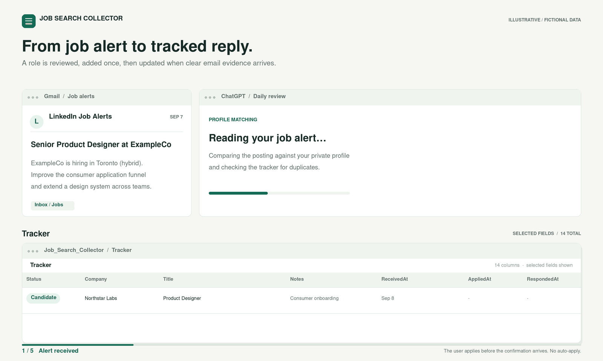
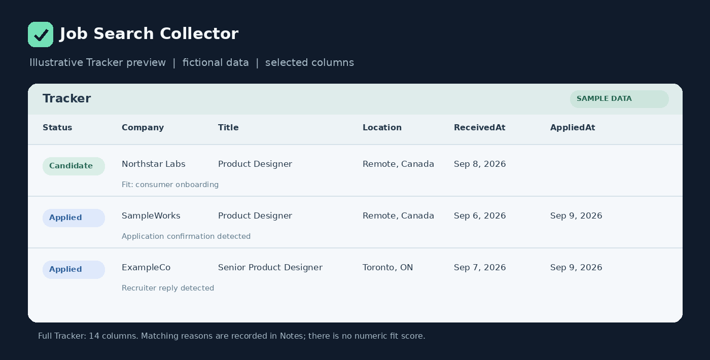

[English](README.md) | [한국어](README.ko.md)

# Job Search Collector

**Turn job alerts into a job tracker tailored to your experience.**

Job Search Collector uses a ChatGPT Scheduled Task to review Gmail job alerts and, optionally, discover public job postings. It compares opportunities with your private career profile, surfaces reasons for a match, removes duplicates, and tracks applications and replies in Google Sheets when the connected tools allow it.

**Gmail alerts + optional web discovery → career fit → one Google Sheets tracker**



*Illustrative sequence with fictional data. This is not a recording of a live connected account.*

### See the result first



This **fictional example** shows a few of the Tracker's columns. The actual Tracker has [14 columns](docs/sheet-schema.md#tracker), including application and response dates. Match reasoning goes in `Notes`, rather than a separate score column.

| Status | Company | Title | Location | Notes | ReceivedAt | DiscoveryType | Source |
|---|---|---|---|---|---|---|---|
| Candidate | Northstar Labs | Product Designer | Remote, Canada | Relevant consumer onboarding work | 2026-09-08 | Search | Company Careers |
| Applied | ExampleCo | Senior Product Designer | Toronto, ON | B2C funnel and design-system experience fit | 2026-09-07 | Mail | LinkedIn |

Follow the [fictional end-to-end example](examples/sample-run.md) from job alert to recruiter reply without connecting any accounts. The [example daily output](examples/output.example.md) shows matching reasons, exclusions, and diagnostics.

### What it does for you

- Finds opportunities from job-alert email and, if enabled, public web search.
- Prioritizes roles using your experience and practical constraints, with reasons you can review.
- Checks against Tracker history so the same posting does not keep creating new rows.
- Records clear application confirmations and recruiter replies; uncertain evidence goes to human review.

It never submits applications for you. Sheet updates depend on available actions and permissions; if a scheduled write is blocked, the workflow can return an explicit TSV fallback.

## Start here

You only need **one prompt** to get started: [`prompts/01-bootstrap.md`](prompts/01-bootstrap.md).

Before starting, connect Gmail and Google Drive to ChatGPT.

1. Paste the full `01-bootstrap.md` prompt into a new ChatGPT conversation.
2. Answer ChatGPT's setup questions naturally.
3. After setup, the Scheduled Task checks job-alert email and, if enabled, the public web. It matches relevant jobs and updates Google Sheets when permitted.

No local app, script, terminal command, server, or GitHub Action is required.

`01-bootstrap.md` contains everything needed to set up the workflow.

Your career profile, Gmail content, and Tracker data stay in your connected Google account. The public repository contains reusable workflow files only.

> Product behavior, available apps, and Scheduled Task capabilities can change. Last verified against OpenAI documentation: 2026-09-08.

## What ChatGPT sets up

During the setup conversation, ChatGPT can:

- understand your experience, strengths, target roles, and practical constraints;
- create a private career profile in Google Drive;
- create a brand-new Job Search Collector Google Sheet with `Tracker` as the only user-facing tab, while keeping internal operational tabs hidden when supported;
- find or collect job-alert sources from Gmail and ask you to confirm them;
- ask whether you want additional Web Job Discovery enabled;
- configure recommended application and response tracking behavior;
- create the recurring Scheduled Task;
- run a validation test before setup is considered complete.

Direct writes to Google Sheets happen only when the available actions and permissions allow them. If a scheduled write is blocked, the workflow can return an explicit TSV fallback instead of pretending the update succeeded.

## Onboarding is a conversation, not a form

Users can answer in normal language and include several useful facts in one response. ChatGPT extracts what matters and skips questions that are already resolved.

A typical turn looks like this:

> **Tell me about your current or most recent role and what you actually owned. You can include your title, domain, and scope.**
>
> Example: I was a Senior Data Analyst on a logistics team and owned delivery-performance analytics from metric definition through dashboard rollout.
>
> Questions remaining: about 7

The onboarding intentionally keeps the interface compact:

- one question per turn;
- the question is the main visual emphasis;
- career and preference questions include a short fictional example;
- normal questions are not labeled `Required`;
- only optional questions are marked;
- the only progress indicator is an approximate remaining-question count at the bottom.

You do not need to provide a perfect career profile during setup. Once there is enough information for useful matching, setup can continue.

## Update your profile anytime

The profile is not final after onboarding.

If you later mention a new project, skill, target role, work preference, location constraint, or other long-term matching detail in the same conversation, ChatGPT can recognize that it may matter and ask whether you want to update the profile.

Example:

> This could affect future job matching. Would you like me to update your profile?

The profile is changed only after your approval.

Normal career-profile updates do not require recreating the Scheduled Task because the task reads the private profile again on each run. Operational changes such as schedule time or automation settings may require updating Config or the existing Scheduled Task, and ChatGPT should ask before making those changes.

## Matching is based on actual fit

Job Search Collector does not treat an exact title match as the main definition of fit.

A stated title or seniority level is an anchor, not automatically a whitelist. The workflow considers actual responsibilities, ownership, problem types, impact, leadership expectations, domain, skills, and practical constraints.

Internally, the workflow distinguishes:

- **Core target**: the user's main direction
- **Consider if fit**: nearby titles or broader levels worth evaluating when the actual scope fits
- **Hard exclude**: roles or conditions the user explicitly does not want

For experienced users, a Strong match should normally have a meaningful reason beyond title similarity.

## Daily workflow


At the scheduled time, the workflow can:

1. read the unprocessed job-alert period from Gmail;
2. when Web Discovery is enabled and due, search supported ATS domains and broader web results for additional roles;
3. open and verify actual web posting pages before treating them as normal candidates;
4. merge mail and web candidates into one matching pipeline;
5. expand digest emails and classify messages from sender + subject + body;
6. extract job details and usable application links;
7. deduplicate postings against the current run and verified Tracker history;
8. evaluate actual job fit using the private career profile;
9. detect clear application confirmations or recruiter submissions;
10. detect employer or recruiter responses;
11. update the Tracker when allowed;
12. flag no-response applications and report diagnostics.

The workflow never claims to submit applications on the user's behalf.

## Mail and Search stay distinguishable

The Tracker keeps one unified job history for reliable duplicate detection, while `DiscoveryType` separates how each row first entered the Tracker:

- `Mail` for Gmail-derived opportunities or application evidence
- `Search` for public-web discovery

`Source` separately stores the concrete platform, such as LinkedIn, Indeed, Greenhouse, Workday, or Company Careers. This keeps Mail/Search filtering independent from platform filtering.

## Fresh Tracker by design

Bootstrap always creates a new Job Search Collector Tracker using this workflow's own schema.

It does not ask to reuse, import, adapt, or merge an existing spreadsheet during setup. If a file named `Job_Search_Collector` already exists, a new unique name such as `Job_Search_Collector_2` is used automatically.

If historical application data needs to be migrated, handle that separately after setup in another ChatGPT conversation.

## Privacy

The public repository contains reusable prompts, templates, examples, and documentation only.

A user's actual:

- career profile
- Gmail content
- application history
- Tracker data

remain in that user's connected Google account.

Detailed career information is not embedded into the public prompt or shared Scheduled Task template. The Scheduled Task reads the user's private profile through `Config.profile_reference`.

## Reliability and safety rules

A few important safeguards are built into the workflow:

- missed scheduled runs can catch up using `Control.last_successful_scan_date`;
- sender address alone does not define a message type;
- partial Tracker reads are not used to prove that something is absent;
- harmless Company/Title formatting differences such as dash variants, whitespace, case, and supported legal suffixes are normalized for duplicate comparison;
- previously seen but unapplied jobs can surface again instead of being permanently hidden as historical duplicates;
- missing links are left blank instead of being invented;
- unfamiliar company relationships are not guessed;
- ambiguous recruiter or response evidence goes to Human review;
- application status changes require clear evidence;
- no-response cases are not automatically closed by default.

## Contribute

Want to improve a job-alert format, matching edge case, example, or translation? See [CONTRIBUTING.md](CONTRIBUTING.md) and [open an issue](https://github.com/aaidensong/job-search-collector/issues/new/choose). Use fictional or redacted data when reporting a problem.

## Advanced documentation

The README is intentionally user-focused. Implementation details live in `docs/`:

- [`docs/user-flow.md`](docs/user-flow.md) - end-to-end user and system flow
- [`docs/profile-questionnaire.md`](docs/profile-questionnaire.md) - onboarding UX and question rules
- [`docs/matching-rules.md`](docs/matching-rules.md) - fit and exclusion logic
- [`docs/web-job-discovery.md`](docs/web-job-discovery.md) - Phase 1 public-web discovery rules
- [`docs/sheet-schema.md`](docs/sheet-schema.md) - Tracker, Config, Sources, and Control schema
- [`docs/architecture.md`](docs/architecture.md) - system architecture and responsibilities
- [`docs/profile-file.md`](docs/profile-file.md) - private profile format
- [`docs/troubleshooting.md`](docs/troubleshooting.md) - common setup and runtime issues

## Repository structure

```text
job-search-collector/
├── README.md
├── README.ko.md
├── LICENSE
├── ATTRIBUTION.md
├── assets/
│   ├── sample-workflow.gif
│   ├── tracker-preview.png
│   └── social-preview.png
├── job-search-collector-flow.png
├── job-search-collector-flow-ko.png
├── prompts/
│   ├── 01-bootstrap.md
│   ├── 02-daily-job-search-collector.md
│   ├── 03-test-run.md
│   └── 04-update-profile.md
├── profiles/
│   └── profile.template.md
├── tools/
│   └── render_previews.py
├── docs/
└── examples/
```

For normal users, `01-bootstrap.md` is the only prompt they need to copy manually. The other prompt files are standalone maintenance and reference copies for the workflow.

## Versioning

Current versions:

- `config_version = 5`
- `profile_version = 2`

## OpenAI references

- Scheduled Tasks: https://help.openai.com/en/articles/10291617
- Connecting and managing app accounts: https://help.openai.com/en/articles/20001494-connecting-and-managing-app-accounts-in-chatgpt
- Google Drive app setup: https://help.openai.com/en/articles/10929079
- Google app data controls: https://help.openai.com/en/articles/10408842-google-app-data-controls-faq

## License

Except where otherwise noted, the original prompts, documentation, examples, templates, preview assets, and optional preview-rendering script are licensed under **Creative Commons Attribution 4.0 International (CC BY 4.0)**.

Suggested attribution:

> Job Search Collector by Aiden, licensed under CC BY 4.0.

See the standard terms in [LICENSE](LICENSE) and the repository-specific scope and third-party attribution in [ATTRIBUTION.md](ATTRIBUTION.md).
